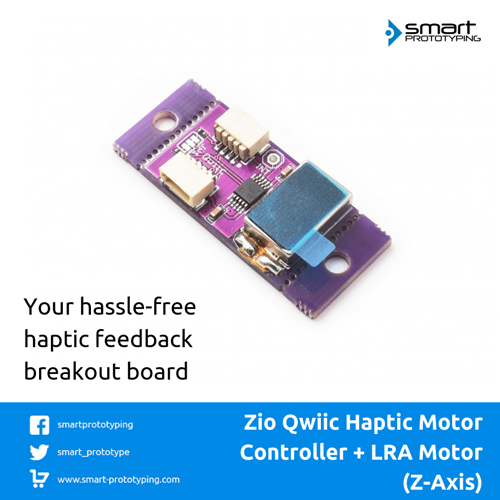

# Zio Qwiic Haptic Motor Controller + LRA Motor Z-Axis (Rectangle-LVM081230B)

> This product can be available for purchase [here](https://www.smart-prototyping.com/Zio-Qwiic-Haptic-Motor-Controller-LRA-motor-z-axis-LVM081230B).

#### Description

As the product name itself says, this tiny board combines the Haptic motor driver (DRV2605L) and the rectangle LRA motor. So they can work together directly. 

The rectangle LRA motor on board, compares to the round LRA motor, the vibrations are directed in only the Z-axis. This offers users a greater choice in design as they can produce vibrations in either horizontal or vertical directions.

Check the source documentation [here](https://www.precisionmicrodrives.com/vibration-motors/linear-resonant-actuators-lras/)

It is a Qwiic (I2C) compatible model, with the qwiic system you can embed this motor board into Qwiic project without soldering and jumper wire connection!

#### Specification

* Motor driver IC: DRV2605L
* Z-Axis motor Manufacture Number: LVM081230B
* IC: DRV2605L
* I2C address: 0x5A
* PCB Dimension: 14.5 x 35.7 mm
* Weight: 4.9g

#### Links

* [PCB source file](https://github.com/ZIOCC/Zio-Qwiic-Haptic-Motor-Controller-LRA-motor-Z-axis-LVM081230B/tree/master/EAGLE)
* [PCB Schematic](https://github.com/ZIOCC/Zio-Qwiic-Haptic-Motor-Controller-LRA-motor-Z-axis-LVM081230B/blob/master/Haptic%20Motor%20driver%20board%20%2B%20LRA%20z-axis%20LVM081230B.pdf)
* [DRV2605L Datasheet](https://www.smart-prototyping.com/image/data/2_components/sensors/101802DRV2605L%20Haptic%20Driver/DRV2605.pdf)
* [Demo Code (adafruit DRV2605 Library)](https://github.com/adafruit/Adafruit_DRV2605_Library)

###### About Zio
> Zio is a new line of open sourced, compact, and grid layout boards, fully integrated for Arduino and Qwiic ecosystem. Designed ideally for wearables, robotics, small-space limitations or other on the go projects. Check out other awesome Zio products [here](https://www.smart-prototyping.com/Zio).
